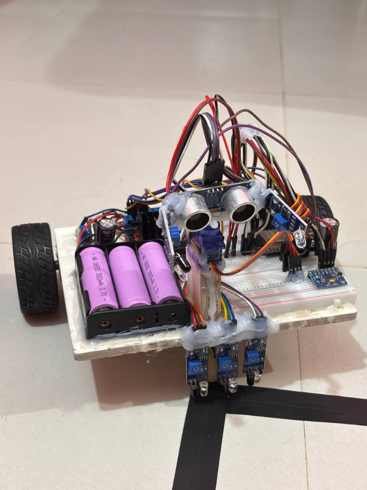
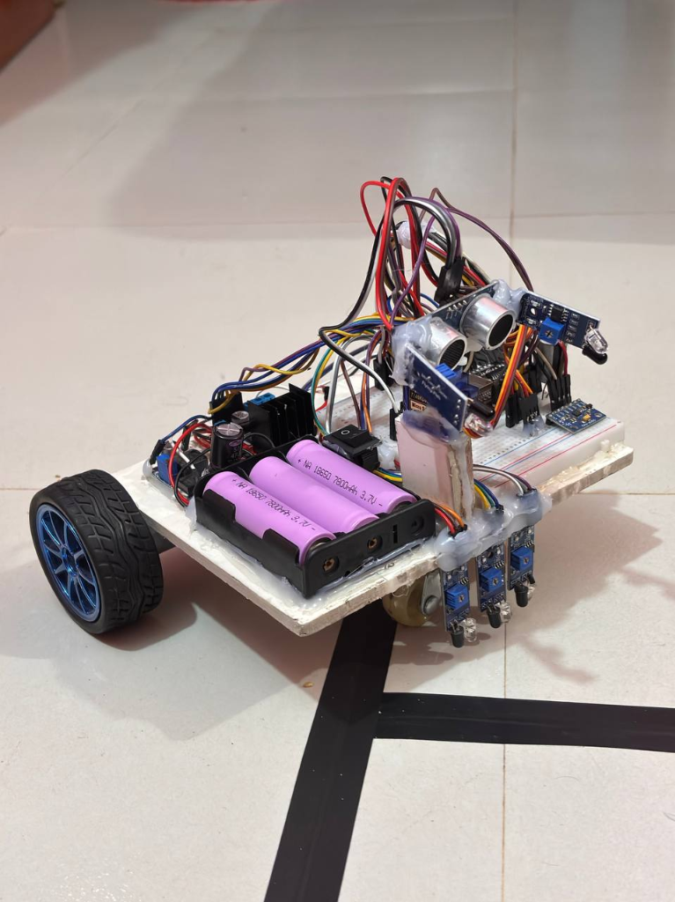

# Multi-Mode Navigation Rover

[](https://www.espressif.com/en/products/socs/esp32)
[](https://platformio.org/)
[](https://www.arduino.cc/)
[](https://www.freertos.org/)
[](LICENSE)

An advanced, ESP32-based mobile robot platform featuring **four distinct operating modes**—Manual Teleoperation, Autonomous Obstacle Avoidance, Line Following, and Object Tracking. All modes and telemetry are accessed via a responsive, zero-installation WebSocket browser web interface hosted directly on the ESP32.

---

## 📋 Table of Contents
- [Project Overview](#-project-overview)
- [Key Objectives](#-key-objectives)
- [System Architecture](#-system-architecture)
- [Hardware Components & BOM](#-hardware-components--bom)
- [GPIO Pin Assignment](#-gpio-pin-assignment)
- [Software Architecture & FreeRTOS Model](#-software-architecture--freertos-model)
- [Operating Modes](#-operating-modes)
- [Web Interface & Radar Visualizer](#-web-interface--radar-visualizer)
- [Safety Features](#-safety-features)
- [User Manual](#-user-manual)
- [Potential Applications](#-potential-applications)
- [Project Credits](#-project-credits)
- [License](#-license)

---

## 📌 Project Overview

The **Multi-Mode Navigation Rover** is a versatile robotics platform engineered for dynamic environments. Built on an ESP32 microcontroller with a dual-core FreeRTOS architecture, the rover separates non-blocking network communication from hard real-time control loops. Users control the rover and monitor sensor streams—including IMU orientation, battery voltage, motor states, proximity, and a live servo-actuated radar sweep—directly from any desktop or mobile browser.

<p align="center">
  
  
</p>

---

## 🎯 Key Objectives

- **Low-Cost Modular Design:** Built using accessible off-the-shelf electronic and mechanical components.
- **Real-Time Web Teleoperation:** High-frequency, bidirectional WebSocket communication over local WiFi or Access Point mode.
- **Multi-Mode Navigation:** Smooth runtime switching between manual control and three autonomous behaviors.
- **Continuous Telemetry:** Live visualization of 6-axis MPU6050 IMU readings, battery voltage, sensor states, and radar scans.
- **Responsive Web UI:** Dual input modes accommodating desktop WASD keyboard controls and mobile virtual joysticks.

---

## 🏗️ System Architecture

```
                       +-----------------------------------+
                       |      Web Interface (Browser)      |
                       |  - WASD / Joystick Teleoperation |
                       |  - Live Radar Canvas & Telemetry  |
                       +-----------------+-----------------+
                                         |
                                (WebSocket / HTTP)
                                         |
+----------------------------------------v----------------------------------------+
|                                    ESP32 MCU                                   |
|                                                                                |
|  +-----------------------------------+   +----------------------------------+  |
|  |       Core 0: TaskNetwork         |   |       Core 1: TaskControl        |  |
|  | - WiFi AP / STA Management        |   | - 15ms Hard Real-Time Control    |  |
|  | - AsyncWebSocket Server           |   | - MPU6050 IMU & ADC Reading      |  |
|  | - Telemetry Broadcast (200ms)     | <---> Mode State Machine             |  |
|  | - WiFi Watchdog                   |   | - PWM Motor Driver (L298N)       |  |
|  +-----------------------------------+   +----------------------------------+  |
|                                FreeRTOS Mutex Sync                             |
+--------------------------------------------------------------------------------+
                                         |
          +------------------------------+------------------------------+
          |                              |                              |
+---------v---------+          +---------v---------+          +---------v---------+
|   L298N Drivers   |          |  Sensors & Servo  |          |  MPU6050 & Power  |
| - Dual DC Motors  |          | - HC-SR04 + SG90  |          | - 6-Axis IMU      |
| - PWM Speed Ctrl  |          | - 3x Line IR      |          | - Battery ADC     |
|                   |          | - 2x Proximity IR |          | - 3S Li-ion Pack  |
+-------------------+          +-------------------+          +-------------------+
```

---

## 🛒 Hardware Components & BOM

### Component List
| Component | Specification | Role |
| :--- | :--- | :--- |
| **ESP32 DevKit v1** | 240 MHz dual-core, WiFi/BT | Main MCU — WebSocket server, task scheduler, control logic |
| **L298N Motor Driver** | 2 A dual H-bridge | Controls direction and PWM speed for left & right motors |
| **DC Gear Motors (x2)** | 6 V, ~150 RPM | Left and right wheel drive; independently controllable |
| **MPU6050 IMU** | 6-axis (Gyro + Accel), I²C | Telemetry (tilt, yaw, acceleration magnitude, temperature) |
| **HC-SR04 Ultrasonic** | 2–400 cm range | Forward distance measurement for obstacle and object tracking |
| **SG90 Servo** | 180° rotation | Rotates ultrasonic sensor for 30°–150° radar sweeps |
| **IR Line Sensors (x3)** | Digital output | Ground-facing Left/Center/Right array for line tracking |
| **IR Proximity Sensors (x2)** | Digital output (`INPUT_PULLUP`) | Forward-facing Left/Right sensors for object tracking |
| **Li-ion Battery Pack** | 3.4 V x 3S (10.2 V nominal) | Main power source; monitored via resistor divider |
| **Ball Caster Wheel** | Omni-directional | Third support wheel for smooth turning |

### Bill of Materials (Expenses)
| SL | Item Description | Qty | Unit Rate (Tk) | Total Amount (Tk) |
| :-: | :--- | :-: | :-: | :-: |
| 1 | ESP-32 Dev Board | 1 | 490 | 490 |
| 2 | Breadboard | 2 | 70 | 140 |
| 3 | DC Gear Motors | 2 | 350 | 700 |
| 4 | Wheels | 2 | 200 | 400 |
| 5 | Motor Coupler | 2 | 120 | 240 |
| 6 | Ball Caster | 1 | 75 | 75 |
| 7 | MPU-6050 IMU Module | 1 | 200 | 200 |
| 8 | IR Sensors | 5 | 55 | 275 |
| 9 | HC-SR04 Ultrasonic Sensor | 1 | 75 | 75 |
| 10 | Power Switches | 2 | 10 | 20 |
| 11 | Battery Voltage Sensor Board | 1 | 90 | 90 |
| 12 | Power Cables | 2 | 10 | 20 |
| 13 | Jumper Cables | 40 | 2 | 80 |
| 14 | Capacitors | 2 | 4 | 8 |
| 15 | SG90 Micro Servo | 2 | 120 | 240 |
| 16 | Hot Glue Stick | 6 | 10 | 60 |
| 17 | L298N Motor Driver Module | 1 | 140 | 140 |
| 18 | 18650 Li-ion Batteries | 3 | 80 | 240 |
| 19 | Custom PVC Chassis Base | 2 | 40 | 80 |
| **Total** | | | | **3,573 Tk** |

---

## 🔌 GPIO Pin Assignment

| GPIO Pin | Signal Name | Description | Configuration |
| :-: | :--- | :--- | :--- |
| **GPIO 25** | `IN1` | Right motor direction bit 1 | Output |
| **GPIO 26** | `IN2` | Right motor direction bit 2 | Output |
| **GPIO 23** | `ENA` | Right motor PWM speed enable | Output (LEDC Channel 5, 1 kHz, 8-bit) |
| **GPIO 14** | `IN3` | Left motor direction bit 1 | Output |
| **GPIO 27** | `IN4` | Left motor direction bit 2 | Output |
| **GPIO 17** | `ENB` | Left motor PWM speed enable | Output (LEDC Channel 6, 1 kHz, 8-bit) |
| **GPIO 16** | `SERVO` | SG90 radar servo PWM signal | Output (ESP32Servo) |
| **GPIO 18** | `TRIG` | Ultrasonic trigger output | Output |
| **GPIO 19** | `ECHO` | Ultrasonic echo pulse input | Input |
| **GPIO 5** | `IR_LF_L` | Line Follow IR Sensor — Left | Input |
| **GPIO 15** | `IR_LF_C` | Line Follow IR Sensor — Center | Input |
| **GPIO 4** | `IR_LF_R` | Line Follow IR Sensor — Right | Input |
| **GPIO 33** | `IR_OF_L` | Object Follow IR Sensor — Left | `INPUT_PULLUP` |
| **GPIO 32** | `IR_OF_R` | Object Follow IR Sensor — Right | `INPUT_PULLUP` |
| **GPIO 21** | `SDA` | I²C Serial Data (MPU6050) | Open-drain |
| **GPIO 22** | `SCL` | I²C Serial Clock (MPU6050) | Open-drain |
| **GPIO 34** | `BAT_ADC` | Battery voltage monitor (resistor divider) | Analog Input |

---

## ⚡ Software Architecture & FreeRTOS Model

Firmware is built in C++ using the Arduino framework for ESP32 on **PlatformIO**. It runs two dedicated FreeRTOS tasks pinned to separate CPU cores:

- **TaskNetwork (`PRO_CPU` - Core 0):** Manages WiFi connection (STA mode with fallback AP `Bot_WiFi`), WebSocket communications, JSON telemetry serialization every 200 ms, and a 2-second network watchdog.
- **TaskControl (`APP_CPU` - Core 1):** Executes the hard real-time control loop at a **15 ms cycle time**, reading sensor states, running mode state machines, computing stuck detection, and driving motor PWM outputs.
- **State Synchronization:** Shared data structures between networking and motor tasks are guarded using a FreeRTOS binary mutex (`stateMutex`).

---

## 🕹️ Operating Modes

### Mode 1 — Manual Teleoperation
- Operator direct control via desktop **WASD keyboard keys**, on-screen **D-pad**, or mobile **virtual joystick**.
- Real-time drive speed configuration slider (80–255 PWM).
- Servo radar angle manual positioning (30°–150°) and live distance readout.

### Mode 2 — Autonomous Obstacle Avoidance
- Autonomous forward drive while continuously measuring distance with HC-SR04.
- When an obstacle is detected within threshold, rover stops, sweeps servo left (150°) and right (30°), calculates clearances, reverses, and turns toward the open path.
- **IMU Stuck Detection:** Accelerometer magnitude checks ensure auto-recovery maneuvers trigger if the rover becomes physically trapped.

### Mode 3 — Line Following
- Ground-facing 3-channel IR array (Left, Center, Right):
  - `Center only`: Drive forward full speed.
  - `Center + Left / Right`: Gradual directional correction.
  - `Left / Right only`: Sharp pivot turn.
  - `All 3 active`: Intersection handling (continue straight).
  - `None active`: Maintain last known correction trajectory until line re-acquired.

### Mode 4 — Object Tracking / Following
- Dual front-facing IR proximity sensors (`IR_OF_L` and `IR_OF_R`).
- Tracks target movement (steering left/right toward object).
- Ultrasonic range enforcement: Maintains safe distance and automatically reverses if the target moves closer than 10 cm.

---

## 🖥️ Web Interface & Radar Visualizer

The web interface is a responsive single-page web app built with HTML5, CSS3, and JavaScript, served straight from the ESP32:
- **Radar Visualizer:** HTML5 Canvas rendering animated radar sweeps with color-coded distance arcs (Blue = Left, Cyan = Center, Red = Right).
- **Sidebar Telemetry Widget:** Live tilt angle (°), acceleration magnitude ($m/s^2$), temperature (°C), battery voltage ($V$), compass motor indicator, and gyroscope axes.
- **Dual Telemetry Console:** Togglable terminal showing incoming WebSocket JSON payloads and outgoing control commands.

---

## 🛡️ Safety Features

- **Emergency Safe-Stop Flag:** Halts motor output immediately when requested or upon error.
- **WiFi Watchdog:** Auto-reconnects on drop and automatically halts rover movement if communication is lost for >2 s.
- **Software Speed Clamping:** All PWM motor drive parameters strictly clamped to `[-255, 255]`.
- **Brownout Reset Disabled:** Prevents MCU brownout resets caused by sudden motor inrush currents (`WRITE_PERI_REG(RTC_CNTL_BROWN_OUT_REG, 0)`).
- **Stuck Detection Recovery:** Automatically detects wheel slip/stalls via IMU accelerometer and executes recovery maneuvers.

---

## 📖 User Manual

### Startup Procedure
1. Connect the 3S Li-ion battery pack.
2. Wait ~5 seconds for ESP32 bootup and WiFi connection.
3. Open Serial Monitor (`115200 baud`) to find assigned local IP address, or connect your mobile/laptop to fallback WiFi AP (`SSID: Bot_WiFi`, `Password: 12345678`).
4. Navigate to `http://<ESP32_IP_ADDRESS>` in your Web Browser.
5. Verify header status shows **CONNECTED** with a green pulse dot.

### Driving
1. Select operating mode from the sidebar navigation menu.
2. Press the **START** button (button changes to **STOP**).
3. Use WASD keys/Joystick in Manual mode, or allow the robot to navigate autonomously in Modes 2, 3, or 4.
4. Press **STOP** at any time to immediately cut motor power.

---

## 🚀 Potential Applications

- **Industrial & Warehouse Logistics:** Autonomous material transportation along tape lines or open floor paths.
- **Remote Hazardous Environment Inspection:** Remote surveillance using teleoperation and radar in tight or toxic spaces.
- **Search & Rescue Support:** Multi-sensor mapping and obstacle avoidance in unpredictable terrain.
- **Academic Robotics & Control Research:** Flexible testbed for sensor fusion, FreeRTOS multi-threading, and WebSocket IoT control.

---

## 👥 Project Credits

This project was developed for **Course ME 3116: Instrumentation & Control Sessional** at **Rajshahi University of Engineering & Technology (RUET)**.

### Group Members
- **Meher Afroz** (Roll: `2202037`)
- **Bijoy Rahman** (Roll: `2202038`)
- **Mahfizur Rahman** (Roll: `2202039`)
- **Fahim Montasir** (Roll: `2202040`) — [GitHub Profile](https://github.com/fahim-m0ntasir/)
- **Palash Sarker** (Roll: `2202041`)

### Course Supervisor
- **Tasnuva Tabashhum Choudhury**
  *Associate Professor, Department of Mechanical Engineering, RUET*

---

## 📄 License

Distributed under the [MIT License](LICENSE). Feel free to use, modify, and build upon this project for educational and commercial applications.
